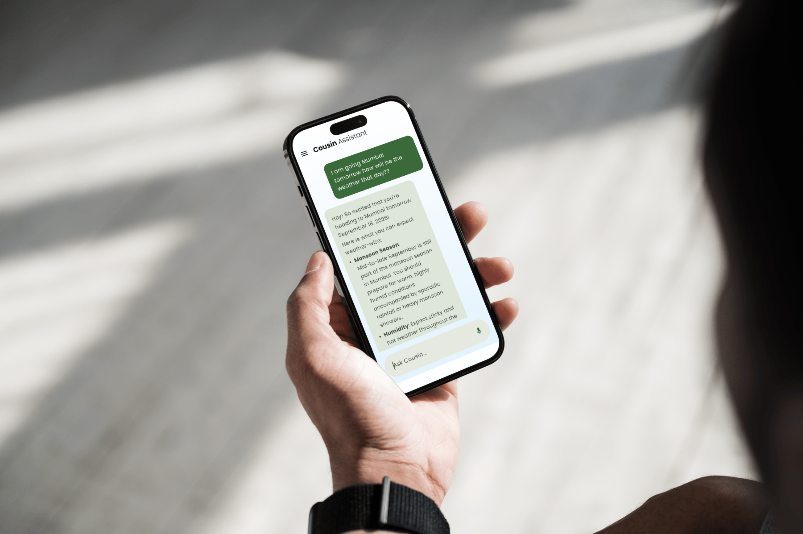
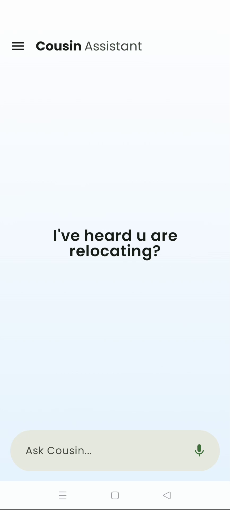
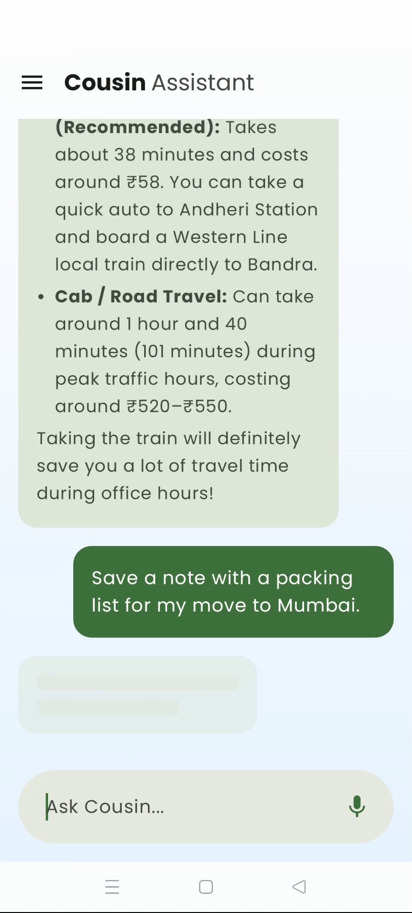
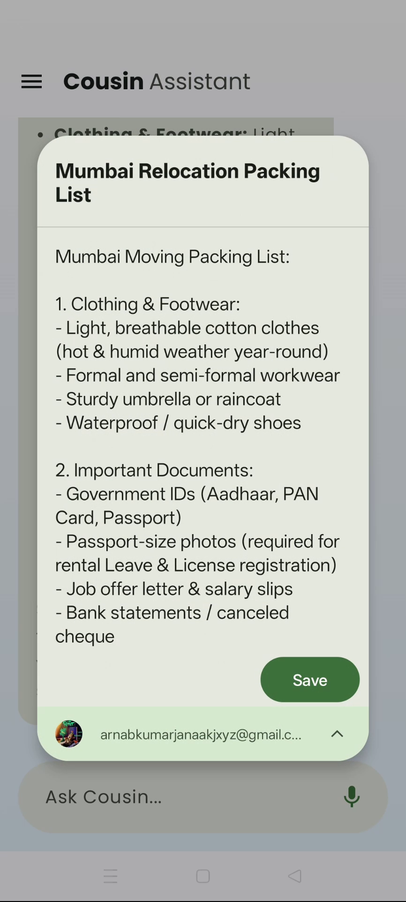
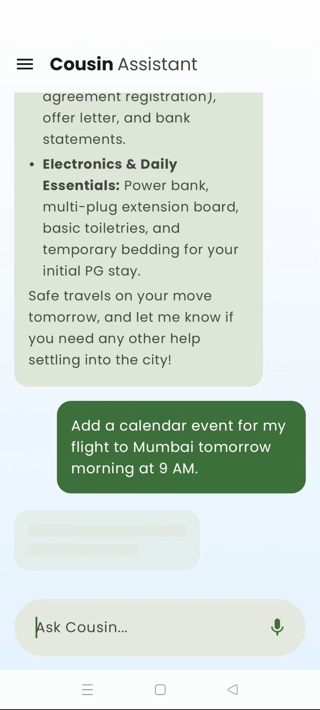
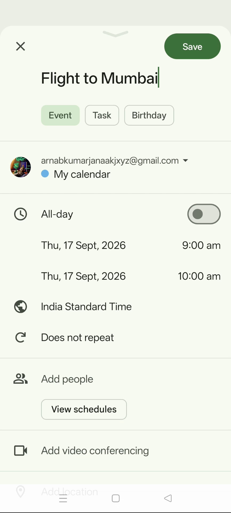

<p align="center">
  
</p>

<p align="center">
  
</p>

<h1 align="center">Cousin In The City (Android)</h1>

<p align="center">
  <a href="https://developer.android.com"></a>
  <a href="https://kotlinlang.org"></a>
  <a href="https://developer.android.com/jetpack/compose"></a>
</p>

An intelligent, AI-powered native Android application designed to act as a personal assistant for users relocating to or navigating a new city. This repository contains the front-end Android client, which seamlessly integrates with the [Cousin In The City Backend](https://github.com/ArnabKrJana/Cousin-In-The-City.git) (Spring Boot AI orchestrator).

---

## App Screenshots

<p align="center">
  
  
  
  
  
</p>

---

## Key Features

* **Offline-First Architecture**: Built around a robust Room Database acting as the Single Source of Truth (SSOT). Network requests happen silently in the background, updating Room, which pushes instant reactive UI updates via Kotlin `Flow`.
* **Agentic Native Intents**: The app securely intercepts structured XML/JSON intents generated by the AI backend and natively routes them to OS-level applications:
  * **Google Maps**: Automatic route planning and location searching.
  * **Google Calendar**: Native event scheduling and reminders.
  * **Google Keep**: Automatic note-taking and list generation.
* **Infinite Scroll (Paging 3)**: Efficiently handles massive chat threads without dropping frames or running out of memory.
* **Hands-Free Voice Input**: Fully integrated with Android's native `SpeechRecognizer` for seamless voice-to-text prompting.
* **Push Notifications**: Firebase Cloud Messaging (FCM) integration. The app automatically registers and synchronizes unique device tokens with the PostgreSQL backend to receive real-time background payloads.
* **Modern UI/UX**: Built entirely with Jetpack Compose Material 3, featuring swipe-to-delete gestures, dynamic thread creation, and pinned chats.

---

## Tech Stack

* **Language**: Kotlin
* **UI Toolkit**: Jetpack Compose
* **Architecture**: Clean Architecture (MVVM)
* **Concurrency**: Coroutines & Kotlin Flows
* **Local Persistence**: Room Database
* **Pagination**: Paging 3
* **Networking**: Retrofit2 & OkHttp3
* **Dependency Injection**: Dagger Hilt
* **Cloud Messaging**: Firebase (FCM)
* **AI Orchestration**: Powered by Gemini & Spring Boot

---

## Getting Started

1. Clone the repository:
   ```bash
   git clone https://github.com/ArnabKrJana/CousinInTheCityAndroid.git
   ```
2. Open the project in **Android Studio**.
3. Ensure your local [Spring Boot backend](https://github.com/ArnabKrJana/Cousin-In-The-City.git) is running on the same network.
4. Update the `BASE_URL` in `NetworkModule.kt` to match your backend's IP address.
5. Build and run the app on an Android Emulator or physical device (API 28+).
